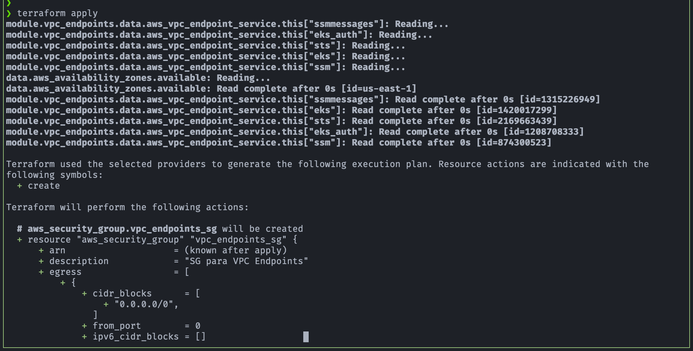
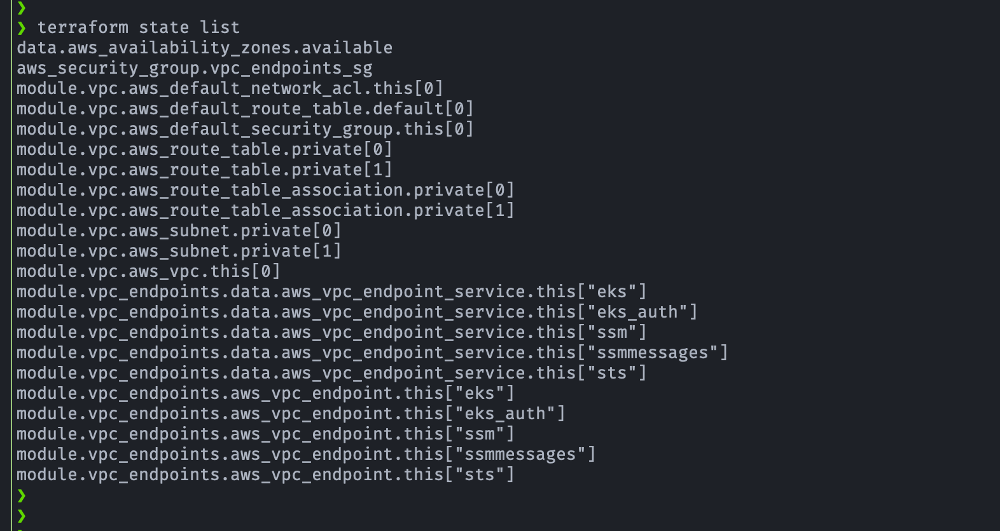
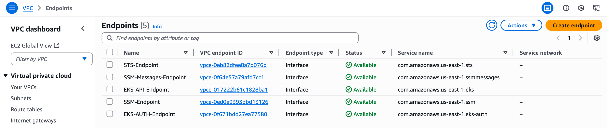
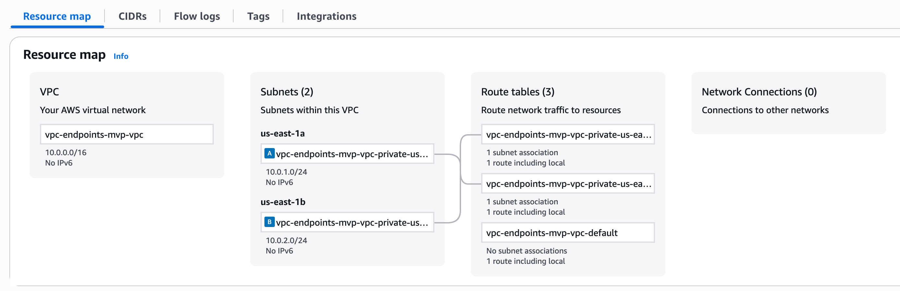
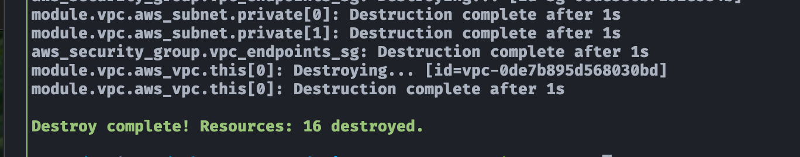

# 🧪 Lab Personal: MVP de creación de VPC Endpoints

> Este repositorio contiene un **laboratorio mínimo funcional (MVP)** para crear VPC Endpoints en AWS utilizando Terraform. Es un ejemplo básico para comenzar con el acceso privado a servicios de AWS desde una VPC.  

## 🎯 Objetivos del MPV
- Proveer una configuración mínima y funcional con Terraform para desplegar VPC Endpoints en AWS, sirviendo como punto de partida para aprender, validar conectividad privada y construir laboratorios más avanzados de red y seguridad.

---

## ⚙ Tecnolgías usadas
- La arquitectura desplegada es:
    - **VPC** con subnets privadas en múltiples Zonas de Disponibilidad.  
    - **VPC Endpoints** (Interface/Gateway) para servicios principales de AWS (ej. EKS, S3, SSM).  
    - **Security Groups** con reglas mínimas de acceso a los endpoints.  

## ⚙ Este MVP del workflow de VPC Endpoints incluye solo lo esencial
- Crea una VPC con subnets privadas.
- Implementa endpoints básicos (ej. EKS, S3, SSM).
- Reglas de seguridad mínimas.
- Outputs de Terraform listos para usar.

---

## 🚀 Demostración y prueba del laboratorio
### Terraform Apply
 

    

### Terraform state list

    

### Vista de Endpoints en la consola de AWS

    

### VPC Resource Map

    

### Terraform Destroy

    

---

## 🔗 Referencias
- 

---

### 📝 Licencia

Este repositorio está disponible bajo la licencia MIT.
Puedes usar, modificar y compartir libremente el contenido, incluso con fines comerciales.
Consulta el archivo [`LICENSE`](./LICENSE) para más detalles.

---
